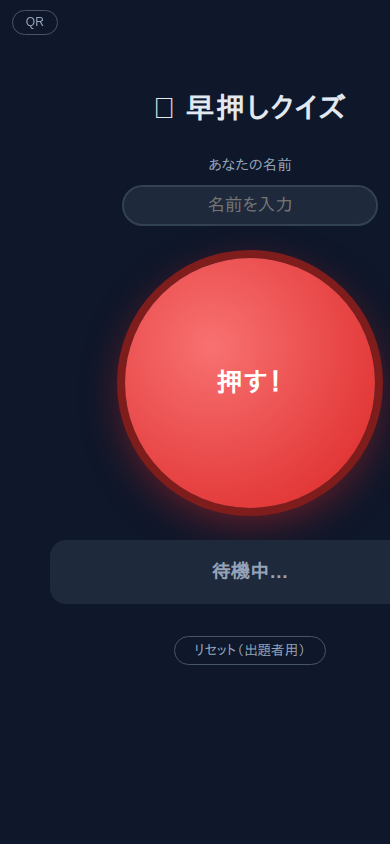
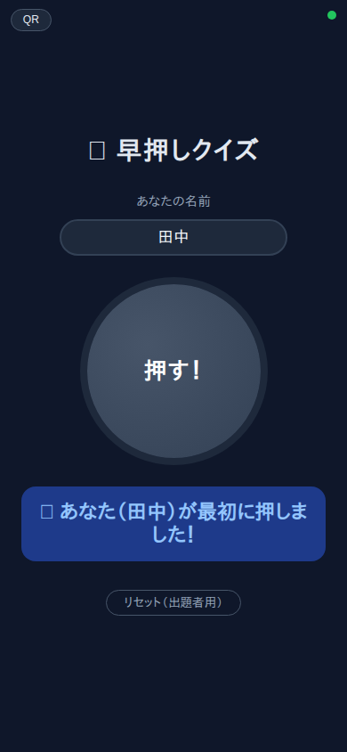
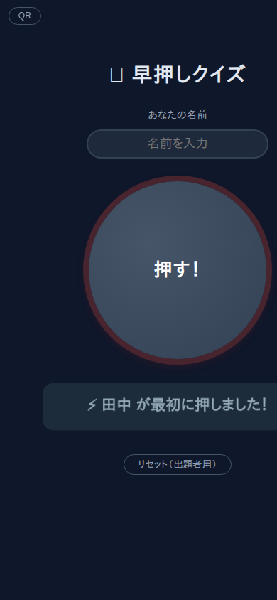

# 早押しクイズボタン

ブラウザで動くリアルタイム早押しクイズシステムです。外部ライブラリ不要、Python 3.7 以上で動作します。

| 待機中 | 自分が一番！ | 誰かが先に押した |
|:---:|:---:|:---:|
|  |  |  |

## 起動方法

```bash
python3 server.py          # ポート 8000 で起動
python3 server.py 9000     # ポートを変更する場合
```

## 参加者の接続

### 同じ端末でテストする場合
```
http://localhost:8000
```

### 同じ Wi-Fi 内の別端末（スマホなど）から接続する場合

サーバーを起動した PC の IP アドレスを確認します。

```bash
# Linux / Mac
hostname -I
```

確認した IP を使って以下の URL をスマホで開きます。

```
http://192.168.x.x:8000
```

**QR ボタンを使うと簡単に共有できます。** 画面左上の「QR」ボタンを押すと、現在のURLのQRコードが表示されます。参加者はそれをスキャンするだけで接続できます。


## 使い方

1. ブラウザで URL を開く
2. 名前を入力する
3. 赤い **「押す！」** ボタンを押す
4. 最初に押した人の名前が全員の画面にリアルタイムで表示される
5. 出題者が **「リセット（出題者用）」** を押すと次の問題へ進める

## その他

- スマホでページを開いている間、**画面スリープを自動的に抑制**します（無音動画ループによる制御）
- 状態はロングポーリングで全クライアントにブロードキャストされます
